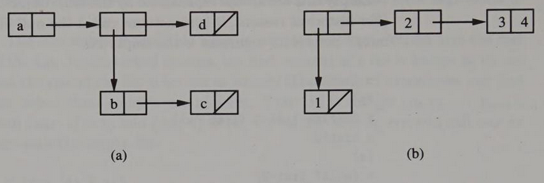
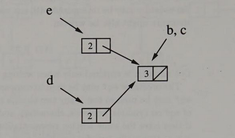

# 1 Tools for Symbolic Programming

符号化编程的工具

You are about to begin the study of programming language. It would be convenient if all the concepts behind programming languages could be explained using only natural language. Unfortunately, many aspcects of programming languages requre a high degree of precision, and natural language is not precise enough. In additon, we want to do more than just describe programming languages: we want to show how they are implemented. To fulfill these purposes, we use three different modes of expression:

1. For motivation and explanation, we use ordinary English.
2. When we need to be precise, we use the language of elementary mathematics: sets, functions, and elementary algebra.
3. When we need to display actual algorithms and implementations, we use the programming language Scheme.

注: 我们希望完全能够使用自然语言，如英语来描述编程语言的概念。然而自然语言缺乏所需的精确性。另一方面，我们不但要描述编程语言，我们还要描述编程语言的实现细节。因此我们选取了不同的方式来实现我们的任务:

1. 使用英语来描述意图，进行解释 。
2. 在需要精确表达的场合，我们使用初等数学: sets(集合), functions(函数), elementary algebra(初等代数).
3. 使用Scheme语言来描述具体算法和实现。

The first two chapters of this book are designed to familiarizes you with reading and writing Scheme programs. This includes a number of techniques for manipulating symbolic information of the kind found in programs and their run-time data structures. Particular emphasis is placed on techniques for functional programming, especially recursion. Along the way, we also introduce several fundamental concepts that allow us to talk precisely about programming languages. These are the basics you need to understand the rest of the book.

注: 读者将通过前2章来熟悉Scheme编程语言。包括一些技巧，操作程序中的字符，运行的数据结构。着重于函数式编程，及递归，及若干描绘编程语言的基本概念。

We begin in section 1.1 by introducitng several basic ways of building Scheme expressions. Section 1.2 introduces a few primitive data types that taken together make Scheme especially suitable for symbolic programming. This is followed in section 1.3 by a discussion of procedures, which may be used with more flexibiltiy in Scheme than in most other languages.

For every form of expression ( or other components of a program ) it si useful to distinguish between its syntax, which refers to rules governing how it is formed, and its semantics, which refers to rules that specify its meaning.

If you are already familiar with Scheme or another dialect of LISP, you may wish to skim this chapter quickly, taking note of any unfamiliar terminology (indicated by italics), and later refer to this chapter for specific information on Scheme. We introduce only those features of Scheme that are used later in this book.

注: 1.1节论述Scheme表达式, 1.2节介绍几个基本数据类型，1.3节讨论procedure过程, 灵活的过程，还有关于表达式的形式

  LISP和Scheme有什么区别？
  答: 似乎Scheme更简洁、更小型化一些。


  运行Scheme解释器所需要的硬件?
  答: 也可以运行在MCU之上。

---

## 1.1 Simple Expressions

A **statement** is a programming language construct that is evaluated only for its effect. Examples include assignment statement, input/output statements, and control statements(while loops, if statements, etc.). Programs in most languages are composed primarily of statements; such languages are said to be **statement oriented**.

Programming language constructs that are evaluated to obtain values are called **expressions**. Arithmetic expressions are the most common example. Expressions may occur as parts of statements, as in the right-hand side of an assignment statement. The data that may be returned as the values of expressions constitute the expressed values of a programming language. Expressions that are evaluated solely for their value, and not for any other effects of the computation, are said to be **functional**.

Some programming languages, such as Scheme , are **expression oriented**: their programs are constructed of definitions and expressions; there are no statements. This section reviews basic techniques for constructing expressions in Scheme.

### 1.1.1 Literals , Procedure Calls, and Variables,
字符常量, 过程调用, 变量

The simplest form of expression is a **literal** (or constant), which always returns the indicated value. For example, the result of evaluating the **numeral** 2 is a value denoting the number two, which has the printed representation 2. Other literals we shall have occasion to use include **strings**, such as "This is a string.", the **boolean** value  #t (true) anbd #f (false), and **characters**, such as #\a and #\space. We discuss these and other Scheme data types in the next section.

注: 最简单的表达式是literal, 数字，字符串，布尔值，字符，都属于。

The next simplest form of expression is a **variable reference**. The value of a variable reference is the value currently associated with, or **bound** to , the variable. A variable is said to **denote** the value of its **binding**. The data that can be bound to variable constitute the **denoted values** of a programming language. Since all variable references in Scheme are also expressions, and the value of any expression may be bound to a variable, the denoted values and the expressed values of Scheme are the same, at least in the absence of variable assignment (section 4.5).

注: 第二简单的表达式是变量引用。一个变量引用的值就是它当前绑定，索引的值。变量表达了绑定的值。可以被绑定到变量的数据，构成了编程语言的值的表达方式。在Scheme中，所有的变量引用都是表达式，所有的表达式的值都可以绑定到一个变量，表达值和表达式是同一个东西，在没有强行进行变量赋值的情况下(4.5小节)。

Variables are represented by **identifiers**. As in most languages, sequences of letters and digits(not staring with a digit) may be used as identifiers, for example: x, x3, foo, and lognidentifer. Scheme is more premissive than most languages in the use of special characters to form identifers. For example, the following are all identifiers: +, /, two+three, zero?, long_identifer, an-even-longer-identifer. Some special characters, such as parentheses and spaces, are not allowed in identifers. Digits may generallly be used in identifers, e.g. x3,but not as the first character. A few identifers, such as **define** and **if**, are reserved for use as **keywords** and should generally not be used as variables.

注: 变量由标识符来表示，标识符即变量名。在大多数语言中，可以用字符和数字来构成标识符，数字不能作为标识符的开头处。　Scheme中,甚至可以使用特殊字符。下列的合法标识符,+,/ two-three, zero?, long_identifier, an-even-longer-identifer. define, if, 因为是编程语言的关键字，所以不能用做变量名。

Scheme provides standard bindings for a number of variables. For example, + is bound to the addition procedure and zero? is bound to a boolean procedure, or **predicate**, that tests whether its argument is zero. Other standard bindings will be introduced as they are needed. We call procedures that are the values of standard bindings standard procedures. (See appendix I.)

注: Scheme提供了一些标准的绑定变量。如加法过程被绑定给了+，加号；布尔操作绑定了zero?, 测试参数是否为零。标准绑定过程见附录I。

If a value is the binding of some variable, it is often vonvenient to refer to the value by the name of the variable. Howerver, the distinction between the name of a variable and the value of its binding is very important. In this book we observe this distinction by using different fonts. When referring to the variable named "x" as a part of a program, we use the standard typewriter-style font: \sf{x}. When referring to the value of the variable x, we use an italic font: \it{x}. Thus we use "zero?" instead of "the value of the variable zero?" when referring to the numeric zero predicate

Statement-oriented languages usually distinguish between **functions**, which return values and are used in expressions, and **procedures**, which do not return values and are invoked by procedure call statements. Though function calls and procedure calls look the same, syntactically they are distinct: function calls are expressions, while procedure calls are statements. Howerver, since Scheme does not have statements,it does not make this distinction. In fact, Scheme functions are usually called procedures, and Scheme function calls are then referred to as procedure calls. We use the term "function" to refer only to abstract mathematical functions.

The symtax of procedure calls in Scheme is not typical of other programming languages. For example, a call to the procedure p with arguments 2 and 3 is written in Scheme as (p 2 3), instead of p(2 ,3). Parentheses surround the entire procedure call, and its components are separated by spaces. We say that the procedure p is applied to the arguments 2 and 3. Procedure (or funtion) calls are sometimes referred to as applications or combinations.

The general syntax of procedure calls is
(operator operand1 ... oprandn)
The ellipsis "..." indicates possible repetition. There may in general be any number of operands, or possibly none at all (n=0). The operator and each operand are components that are themselves expressions. They are called subexpressions. The operator subexpression is evaluated to obtain a procedure , while the operand subexpressions are evaluated to obtain the arguments of the call before invoking the procedure. (Arguments are also referred to as actual parameters, or simply parameters.) In Scheme, the order in which the operator and operand subexpressions are evaluated is not specified, but in some languages it is guaranteed to be left to right and in others it is always right to left.

Any expression may be used as an operand in a procedure call. For example, the procedure call
(+ x (p 2 3))
contains the operand (p 2 3) , which is itself a procedure call. If the value of (p 2 3) is 6 and x is 3 , then (+ x (p 2 3)) is 9. (More precisely, "the value of (+ x (p 2 3)) is 9." Since a compound expression's value is not likely to be confused with the expression itself, in such cases we shall often omit the phrase "the value of.")

Operators may also be arbitraily complex, as long as they return procedures. Thus if g were a procedure that when applied to 2 returned the addition procedure, then
((g 2) 3 4)
would return 7. Procedures that return procedures are called higher-order procedures, and expressions that return procedures are called higher-order expression. They may be unfamiliar, but much will be accomplished with them later.

1.1.2 Definitions, Programs, and the Read-Eval-Print Loop
Most operations can be expressed as procedure calls. For those that cannot, a small number of **special forms** are required.

Consider the operating of binding the variable x to 3. We would like to accomplish this by saying
(define x 3)
The general definition syntax we use is
(define variable expression)
where **variable** and **expression** indicate an arbitrary variable and expression. If this were a procedure call, with the variable **define** bound to some procedure, **variable** would be evaluated as an argument and its value passed to the procedure. But **variable** may be unbound, in which case it cannot be evaluated. Even if the variable were already bound, say x was bound to 7, it still would not do to evaluate the variable. The special form define must modify the binding of x, which would not be possible if it were simply passed the value 7.

The solution is to declare that the above syntactic form is special -- distinct from a procedure call. Each special form is indicated by an identifier,in this case define, that should not be used as a variable. These special form identifers are called **keywords**. Each special form has its own sequencing rule, that is order of evaluation of subexperssoins. In this case expression is evaluated first, and then variable is bound to the value of expression.

A Scheme program consists of a sequence of definitions and expressions that are executed in order by the Scheme system. These definitions and expressions are said to be at top level. We next discuss a few fetures of typical programming environments in which the Scheme language is used. It should be borne in mind that these are not features of the language itself.

注: 程序环境并不是程序语言的一部分，上下文环境并不是语言的一部分。

Programs may be stored in a file for convenient loading, or they may be entered interactively. In the interactive mode, you enter a definition or expression, which is evaluated as soon as it is complete. When an expression is entered, its value is printed. The system then prints an input prompt and the cycle repeats. This repetitive action is often called the read-eval-print loop. The transcript of a brief interactive session follows.

```scheme
> 3
3
> * ; evaluates to the standard multiplication procedure
#<Procedure>
> (* 2 3)
6
> (define x 3)
> x
3
> (+ x (* 2 3))
9
```
In this case the Scheme prompt is ">". A semicolon ";" and anything following it on the same line is ignored by Scheme so that comments may be inserted in programs and transcripts. In general, procedures cannot be printed. Thus the system simply prints some indication that a procedure has been returned. In this book "#<Procedure>" is that indicator.

Following a definitio, many Scheme systems print the name of the variable defined. As the transcript illustrates, howerver, we choose not to print anything following a definition. This emphasizes that, in general, definitions do not have values. In this respect they are like statements, but their use is more limited. In this book **define** is used only at top level.

A final note about definitions: the value of a variable may be **redefined**. That is , the value of an already defined variable may be changed with another definition.

```
> (define x 2)
> x
2
> (define x (+ 1 x))
> x
3


```

Redefinition is allowed simply to make software development more convenient. In Scheme the values of variables with standard bindings, such as +, can be redefined. This is occasionally useful, for example, if you wish to keep track of how many times + is invoked with a negative argument. Redefinition of standard procedures, however, is risky; other may depend on them in unexpected ways.

The interactive nature of Scheme aids program development. It is also helpful in learning Scheme, because it makes it easy to try things out if youu wish to test your understanding or discover what will happen. Transcripts of interactions with Scheme are also a convenient way of providing examples. We use them frequently. You are urged to study our examples carefully to be sure you understand why Scheme behaves as it does. Sometimes definitions made in one transcript will be used in other transcripts that follow.

Exercise 1.1.1
Start interacting with Scheme today! []

Read-eval-print loops and redefinitions may not be appropriate in some programming environments. For example, a Scheme implementation might be designed to compile Scheme programs on one machine for execution at a later time on other machines. In this case a read-eval-print loop would be meaningless and redefinition would probably be undesirable. By making a clear distinction between a programming language and programming environments that support it, we treat the language itself as an abstraction. Such language abstraction is important, for it allows the same language to be used in many differnet environments.

### 1.1.3 Conditional Evaluation
We have seen that Scheme definitions cannot be expressed with an application, so a special form must be used. Conditional expressions are a second situation in which a special form is requried. The basic conditional expression in Scheme has this syntax:

$$(if test-exp then-exp else-exp)$$

The expression test-exp is evaluated first. If its value is true, then-exp is evaluated, and its value is returned as the value of the entire **if** expression. If the value of test-exp is false, else-exp is evaluated to obtain the value of the if expression.

```
> (if #t 1 2)
1
> (zero? 5)
#f
> (if (zero? 5) 1 (+ 1 2))
3
> (define true #t)
> (define false #f)
< (if (zero? 0)
        (if false 1 2)
        3)
2
> (if (if true false true) 2 3)
3
```

The special form if cannot be implemented as a procedure. For one thing, only one of then-exp or else-exp should be evaluated, and it would be inefficient to evaluate both; but there is an even more compelling reason. An important use of conditionals is to prevent an expression from being evaluated when it is unsafe to do so. For example, we might write

(if (zero? a) 0 (/ x a))

to make sure that a is nonzero before dividing. In this situation, we say the test guards the division. Were if a procedure, its arguments would be evaluated before being applied, so the division-by-zero we were trying to avoid would be performed before it could be stopped.

Several other special forms will be introduced later as they are needed, but define and if are enough to get us started.

## 1.2 Data Types
In this section we explore some of the data types in Scheme. Scheme implementations vary somewhat in the range of data types they support, and the repertoire of operations on the data types also varies. We discuss only those data types and operations that are required in this book. They should be part of every implementation.

For each data type, we shall be concerned with three things:
1. The set of values of that type.
2. The procedures that operate on that type.
3. The representation of values of that type when they appear internally as literals in programs or externally as characters that are read or printed.

For example, in mathematics the data type of sets consists of the sets themselves, the well-defined operations on these sets (such as union, intersection, and set-difference), and the notation used to represent sets.

It is an error to pass a standard procedure a value that is not of the expected type. For example, it does not make sense to try to add a number to #t. **Type checking** is required to detect such type errors. If these checks are perfromed at run time when standard procedures are invoked, as is generally the case for Scheme implementations, we have dynamic type checking. In many languages, an analysis is performed at compile time to detect potential type errors. This analysis , which must be based only on the text of the program and not run-time values, is called static type checking. It has the advantage of catching errors earlier but requires more complicated and restrictive rules for determining if a program is correctly typed.

注: 对于数据类型的动态分析，静态分析的解释。动态类型检查是在程序运行时进行的检查，静态类型检查是在编译时进行的类型检查。保证越早发现类型错误越好。

### 12.1 Numbers, Booleans, Characters, Strings, and Symbols
We have already used two data types: number and boolean. Numbers may be included in Scheme programs in the usual way. The operations on numbers include the standard arithmetic operations, such as +, -, ${**}$,  and /.  The  type predicate number? takes an arbitray value and returns true if its argument is a number and false otherwise. The equality prediate for numbers is =.


The boolean data type has only two values, true and false, represented by #t and #f, respectively. Booleans are used primarily in conditional expressions. The type predicate boolean? tests an arbitrary value to see if it is a boolean, boolean values may be compared for equality using the predicate eq?, and the standard procedure not performs logical negation.

```
> (eq? (boolean? #f) (not #f))
#t
```

Characters that are visible when they print are represented as literals by preceding them with #\, for example #\a and #\%. Some nonprinting characters also have literal representations, such as #\space and #\newline. The character type, equality, and order predicates are char?, char=? , and char<?, respectively, and char->integer takes a character and returns an integer representation of the character. The predicates char-alphabetic?, char-numeric?, and char-whitespace? are used to determine the class of a character. The predicate char-whitespace? returns true when its argument is a space, return or linefeed character.

```
> (char? #\$)
#t
< (char=? #\newline #\space)
#f
> (char<? #\a #\b)
#t


```

Strings are sequences of characters that are represented by surrounding the characters with double quote marks. The string type predicate is string?. The procedure string-length takes a stirng and returns an integer indicating the number of characters in the string. The procedure string-append concatenates its arguments to form a new string. The procedures string->symbol, string->number, and string->list convert a string into a symbol, number, and list of characters, respectively. (Symbols and lists will be discussed soon.) The procedure string takes any number of arguments, which must be characters, and returns a string of these characters. The procedure **string-ref** takes a string and a nonnegative integer less than the length of the string and returns the character indexed by the integer. Indexing is zero based, meaning that the characters are numbered strating with zero.

```
> (define a "This is a.")
> (define ss (string-append s "longer string"))
> (string? s)
#t
> (string-length s)
10
> (string-length ss)
23
> (string #\a #\b)
"ab"
> (string->symbol "abc")
abc
> (string->list s)
(#\T #\h #\i #\s #\space #\i #\s #\space #\a #\.)

```

Programs that process other programs, such as many in this book, frequently manipulate identifiers. Identifiers are central to a number of other kinds of programming, such as artificial intelligence and database applications. In fact, identifiers play an important role in most programs that are not primarily concerned with manipulating numbers. When identifiers are treated as values in Scheme, they are called symbols. The manipulation of symbols is greatly facilitated by providing a distinct data type for them.

按: symbol是标识符的意思，和字符串有着本质的区别。

Just as strings must be surrounded with quote marks to distinguish them from the rest of a program, symbolic literals must be specially marked, for otherwise they would be indistinguishable from variable references. Thus another special form is needed to introduce symbols into programs:

(quote datum)

Here **datum** may be a symbol or any other standard external (printed) representation for Scheme data. The value of a quoted literal expression is the associated data value.

```
> (define x 3)
> x
3
> (quote x)
x
> 99
99
> (quote 99)
99

```

Such expressions are used so often that there is an abbreviation for them. The form (quote datum) may also be written

'datum

utilizing the single-quote character. Most languages have quoting mechanisms of some sort to avoid confusion between literals and other program elements. The only literals that are "self-quoting," meaning that they may be used directly as expressions without being enclosed in a quote expression, are numbers, booleans, strings, and characters.

Two basic operations on symbols are symbol type predicate, symbol?, and the predicate for testing equality of two symbols, eq?,

```
> (define x 3)
> (number? x)
#t
> (symbol? x)
#f
> (number? 'x)
#f
> (symbol? 'x)
#t
> (eq? 'x 'x)
#t
> (eq? 'x 'y)
#f
> (define y 'apple)
> y
apple
> (eq? y (quote apple))
#t
> (eq? y 'y)
#f


```

### 1.2.2 Lists
A list is an ordered dequence of elements, which may be of arbitrary types. Lists are a flexible way of combining multiple values into a single compound object. Scheme provides convenient facilities for creating and manipulating lists. These facilities , along with most other Scheme data types, are derived from the much older language LISP. (The name stands for LISt Processing.)

A list is represented by surrounding representations of its elements with a pair of parentheses. For example, (a 3 #t) represents a list consisting of three elements: the symbol a, the number three, and the value true. Here are a few more lists

()   the empty list
(a)  a list of length 1
((b c d)) a list of length 1 that contains a list of length 3

Just as quote is necessary to distinguish between symbolic literls and variables, it is alos necessary to avoid confusing literal lists with procedure calls or special forms. The expression (quote (a b c)) yields the list (a b c) as its value. Howerver, the expression (a b c) is a procedure call whose value depends on the values of the vairables a, b and c; or perhaps it is a special form where a is a keyword.

There are several standard procedures that build new lists. Here we consider the most important ones, list and cons. The standard procedure list may be applied to any number of arguments. It forms a list of their values. (Most procedures take a fixed number of arguments, but list, string and string-append are exceptions.)


```
> (list 1 2 3)
(1 2 3)
> (define x 3)
> (define y 'apple)
> (list x y)
(3 apple)
> (define list-1 '())
> (define list-2 '(a))
> (define list-3 '((b)))
> (list list-1 list-2 list-3 '(((c))))
(() (a) ((b)) (((c))))
> (list)
()

```

The second important list-building procedure, cons, always takes two arguments. The first may be any Scheme value, and the second must (for the moment) be a list. If its first argument is the value **v** and its second argument is the list (v0 v1 ... vn-1), then cons returns the list (v v0 v1 ... vn-1). The returned list is always one longer than the second argument. The name cons stands for construct, because cons constructs a new compound object. (Actually cons's second argument may be anything. But if it is not a list, the value returned will not be a list either. We discuss this further in section 1.2.3.) Study the following example scarefully; they illustrate several important featues of cons.

```
> (cons 'a '(c d))
(a c d)
> (list 'a '(c d))
(a (c d))
> (cons '(a b) '(c d))
((a b) c d)
> (cons '() '(c d))
(() c d)
> (cons 'a '())
(a)
> (cons '(a b) '())
((a b))
> (define y 'apple)
> (cons y list-2)
(apple a)
> (define list-4 (cons list-1 list-2))
> list-4
(() a)
> (cons list-4 list-3)
((() a) (b))

```

Observe in these examples that if the first element to cons is a list, that list becomes an element of the value returned by cons. To add all elements of a list to the front of another list (in the same order), the procedure append should be used.

```
> (append '(a b) '(c d))
(a b c d)
> (append '() '(c d))
(c d)
> (append '(a b ) '())
(a b)


```

Compare these results with those obtained by passing the same arguments to cons.

The simplest way to divide a list is between the first element and the rest of the list. For historical reasons, the first element of a list is known as its car and the rest of the list is known as its cdr. The standard prcedres car and cdr select these components of a list. Thus if l is the list (v0 v1 ... vn-1), then (car l)=v0 and (cdr l)=(v1 ... vn-1). It is an error to call car or cdr with the empty list.

```
> (car '(a b c))
a
> (cdr '(a b c))
(b c)
> (car (cdr '(a b c)))
b
> (cdr 'a())
()

```

Clearly car and cdr undo what cons does. The exact relationship between car, cdr, and cons is expressed by the eqations

    (car (cons v l)) = v
    (cdr (cons v l)) = l

where v is nany value, l is any list, and = indicates identical values.

Nested calls to car and cdr are so common that Scheme provides an assortment of procedures that take are of the more frequenct cases. For example, the procedures cadr and caddr are defined such that


(cadr l)=(car (cdr l))
(caddr l)=(car (car (cdr (cdr l))))

The sequence of as and ds surrounded by c and r in the procedure name determines the cars and cdrs and their ordering. The rightmost a/d (car/cdr) is performed first, just as the innermost procedure call is done first.

```
> (cadr '(a b c))
b
> (cddr '(a b c))
(c)
> (caddr '(a b c))
c
```

Empty lists are always represented by the dame object, called the **empty list** . (For historical reasons, it is sometimes called the null object.) The predicate null? tests if its argument is the empty list.

```
> (null? '())
#t
> (define list-2 (list 'a))
> list-2
(a)
> (null? list-2)
#f
> (null? (cdr list-2))
#t

```

### Exercise 1.2.1
Fill in the blank lines of the following transcript.

```
> (define x '(a b ((3) c) d))
> (car (cdr x))
# [Answer]

> (cdaddr x)
# [Answer]

> (char? (car '(#\a #\b)))
# [Answer]

> (cons 'x x)
# [Answer]

> (cons (list 1 2) (cons 3 '(4)))
# [Answer]

> (cons (list) (list 1 (cons 2 '())))

```

注: 第一道题很简单，在命令行上敲入执行即可。也许需要写一个详细的如何使用 Chez Scheme的详细教程。

### 1.2.3 Pairs
Most of the time it is desirable to view lists abstractly as we have just done, howerver, it is sometimes necessary to understand how lists are constructed.

In Scheme, nonempty lists are represented as pairs. A pair (sometimes called a **dotted pair** or **cons cell**) is a structure with two fields, called car and cdr. The procedure cons creates a new pair with the car and cdr fields initialized to the values of its first and second arguments, respectively. The procedures car and cdr access the two fields. This explains the behavior introduced in the last section. The type predicate for recognizing pairs is pair?.



Figure 1.2.1 Box diagrams

The structure of values built from pairs is conveniently illustrated by diagrams in which pairs are represented by boxes. Each of these boxes has a left and a right half, representing the car and cdr fields, respectively. Each half contains a pointer to another box if the value of the corresponding field is another pair. If the field value is the empty list, this is represented by a slash through the box. Finally, if the field value is a symbol, number, or boolean, its printed representation is written in the corresponding half of the box. The list (a (b c) d) is represented in figure 1.2.1 (a).

If a list has length n, the result of taking the cdr of the list n times must be the empty list. Thus a list is represented by either the empty list or a chain of pairs, linked by their cdr fields, with the empty list in the cdr field of the last pair of the chain. A cdr-linked chain of cons cells that does not end in the empty list is called an **improper list**, even though it is not a list at all. Figure 1.2.1 (b) illustrates such a data structure. We can denote such data structures in a linear format by writng (a . d) for a pair whose car is a and whose cdr is d. (Hence the term dotted pair.) The data structures in figure 1.2.1 (a) and (b) might be written as

(a . ((b . (c . ())) . (d . ())))

and 
((1 . ()) . (2 . (3 . 4))) respectively. Either of these might appear quoted in a Scheme program. This dot notation may be intermixed with conventional list notation, so the second structure might also be written 

((1) 2 3 .4)

注: 这里的第二种表示的是, 最后一个pair的cdr不为空, 这里用一个点在car, cdr中间出现，用以表示该场景；而第一种表示方法里，最后一个pair的cdr为空。

Dot notation is required only when writing improper lists.

The predicate eq? may be used to compare pairs as well as symbols. In fact, eq? may be used to test if any two objects are the same object. The behavior  of eq? on symbols, booleans, characters, and the empty list is straightforward: if they have the same written representation, they are the same object. This is not necessarily true for numbers, pairs , and strings. The behavior of eq? on numbers is implementation dependent. If eq? is presented with two pairs (or strings), it returns true if and only if they are the same pair (or string). Since cons creates a new pair every time it is called, eq? must be used with caution on lists.

注: predicate, 为谓语、断言、阐明、表示、判断词，等的意思。

```
> (define a (cons 3 '()))
> (define b (cons 3 '()))
> a
(3)
> b
(3)
> (eq? a a)
#t
> (eq? a b )
#f
> (eq? (cons 1 2) (cons 1 2))
#f
> (eq? '() '())
#t


```

In this example a and b are different pairs, even though they both print as (3), so they are not "eq to each other". Howerver , every reference to the variable a returns the same pair, so (eq? a a) is true.

Pairs may be shared. That is the same pair may be referred to by different variable bindings and pair fields.

```
> b
(3)
> (define c b)
> (eq? b c)
#t
> (define d (cons 2 c))
> (define e (cons 2 c))
> d
(2 3)
> e
(2 3)
> (eq? d e)
#f
> (eq? (cdr d) (cdr 3))
#t

```



Here b, c, the cdr of d, and the cdr of e are all the same pair, though d and e are different pairs. Standard printed notation does not represent sharing, but box diagrams do, as figure 1.2.2 illustrates. The sharing of literals is not specified; for example, (eq? '(3) '(3)) could be true or false.

There are procedures for assigning new values to the car and cdr fields of an existing pair, which will be discussed in section 4.5. When a pair is modified by one of these procedures, the change is noted in all data structures that share the pair.

the only other way to detect sharing of pairs is by using eq?.

### Exercise 1.2.2
Fill in the blank lines of the following transcript.

```
> (define x1 '(a b))
> (define x2 '(a))
> (define x3 (cons x1 x2))
> x1

> (eq? x3 (cons x1 x2))

> (eq? (cdr x3) x2)

> (eq? (car x1) (car x2))

> (cons (cons 'a 'b) (cons 'c '()))

> (cons 1 (cons 2 3))


```

### 1.2.4 Vectors
So far we have seen one means for building compound data object in Scheme: the cons cell. These cells may be used to construct lists of arbitrary length. Lists are a derived data type because they are built using primitive data types: the cons cell and the empty list. The advantage of lists is the ease with which new lists may be formed by adding elements to the front of existing lists. However, lists do not provide names for all their elements or random access to them. Compositions of invocations of car and cdr, also called car/cdr chains, are an awkward way of referring to the first few list elements. It is possible to access list elements via an index number, but with conventional lists access time increases linearly with the index, since to reach a given element it is necessary to traverse the cdr pointers of all the elements that appear earlier in the list.

P19

Neither cons cells nor lists correspond to the two ways to build compound data objects that are most commonly provided by programming languages: records and arrays. Record elements are selected by field names. Records are also heterogeneous, meaning that their elements may differ in their type. Arrays , on the other hand, are homogeneous, in the sense that each of their components must be of the same type, and array components are selected by an index number (or multiple index numbers in the case of multidimensional arrays). Both records and arrays provide random access to their components; that is each component may be accessed in the same amount of time.

Scheme does not provide arrays or records directly. Instead it supplies vectors, which may be used in place of arrays and records. Vectors provide random access via index numbers (like arrays) and may be heterogeneous (like records).

The standard procedure vector takes an arbitrary number of arguments, such as list and string, and constructs a vector whose elements contain the argument values. Vectors are written like lists, but with a hash (#) immediately preceding the left parenthesis. By convention, vectors must also be quoted when they appear in programs as literals.

```
> (define v1 (vector 1 2 (+ 1 2)))
> v1
#(1 2 3)
> (define v2 (quote #(a b)))
> v2
#(a b)
> (vector v1 v2)
#(#(1 2 3) #(a b))
> '#(#(a nested vector) (and a list) within a quoted vecotr)
#(#(a nested vector) (and a list) within a quoted vecotr)

```

The number of elements in a vecotr is its length, which may be determined with the standard procedure vector-length. The type predicate for vectors is vector?. The selector vector-ref taks a vecotr and a zero-based index and returns the value of the element indicated by the index. Thus the indices for a given vector are natural numbers in the range from zero through one less than the length of the vector. There are procedures, vector->list and list->vector, for transforming one compound data type into the other.

```
> (define v3 '#(first second last))
> (vector? v3)
#t
> (vector-ref v3 0)
first
> (vector-length v3)
3
> (vector-ref v3 (- (vector-length v3) 1))
last
> (vector-ref '#(another #((heterogeneous) "vector")) 1)
#((heterogeneous) "vector")
> (vector->list v3)
(first second last)


```

Of course it is an error to pass vector-ref an index number that is not a valid index for the given vector.

We use a data structure called a cell, a "one-element" vector. In addition to the procedure make-cell, which constructs a cell, there is a procedure for referencing a cell, cell-ref and one that determines if its argument is a cell, cell?. Cells will be useful in chapter 5 for characterizing languages with side effects and in chapter 6 for describing various parameter-passing mechanisms. See exercise 1.3.2 for an implementation of cells.

The procedure eq? may again be used to test whether two objects are the same vector. An assignment operation for changing the value of a vector element is introduced in section 4.5. As was the case with pairs, the sharing of vectors in data structures may be revealed using eq? or assignment.

### Exercise 1.2.3
Fill in the blank lines of the following transcript

```
> (define v1 (vector (cons 1 2) 3))
> (define v2 (vector 'a v1))
> v2
;; #('a #((1 2) 3))
#(a #((1 . 2) 3))
> (define v3 '#(a #((1 . 2) 3)))
> (eq? v1 v3)
#f

> (eq? v1 (vector-ref v2 1))

> (eq? (vector-ref v1 0)
	(vector-ref (vector-ref v2 1) 0))
	

```

## 1.3 Procedures
As you might expect, **procedure?** is a Scheme type predicate for procedures. The following transcript illustrates this as well as demonstrating that procedures can be treated as values.

```
> (procedure? 'car)
#f
> (procedure? car)
#t
> (procedure? (car (list cdr)))
#t


```

The first two examples distinguish between the symbol car and the procedure car. The second and the third illustrate passing a procedure as an argument to another procedure. In the third, the procedure cdr is also stored in a data structure and returned as the value of another procedure, car. Here are some more complicated examples

```
> (if (procedure? 3) car cdr)
#<Procedure>
> ((if (procedure? 3) car cdr) '(x y z))
(y z)
> (((if (procedure? procedure?) cdr car)
	(cons car cdr))
	'(car in the car))
(in the car)
> (((if (procedure? procedure?) car cdr)
	(cons car cdr))
	'(x y z))
x
```

Procedures are normally called using the application form, as in (+ 1 2), but sometimes we need to call a procedure with argument values that have already been assembled into a list. The standard procedure **apply** is provided for this purpose. It takes a procedure and a list and returns the result of calling the procedure with the values given in the list.

```
> (apply + '(1 2))
3
> (define abc '(a b c))
> (apply cons (cdr abc))
(b . c)
> (apply apply (list procedure? (list apply)))
#t
```

### 1.3.1 lambda
We have seen that Scheme supplies a number of standard procedure. It is also possible for the user to create new procedures, which may not be bound to variables. The special form for creating new procedures is *lambda*. Its most common syntax is

(lambda formals body)

Here formals is a (possibly empty) list of variables, and body is any expression. The listed variables are said to be formal parameters, or bound variables, of the procedure. In many languages, type information must be provided for formal parameters. However, Scheme automatically keeps track of types at run time, so type declarations are not required. (This is more flexible and simplifies code, but has the disadvantage that type errors are not detected until run time, increasing run-time overhead. We shall have more to say about types in chapter 3.) When the procedure is called, the formal parameters (if any) are first bound to (associated with) the arguments, and then the body is evaluated. Within the body, the argument values may be obtained by variables that correspond to the formal parameters. Lambda bindings are not accessible outside the body of the procedure: they are said to be **local** to the procedure's body.

For example, a procedure that adds two to its argument may be created by evaluating the expression:

(lambda (n) (+ n 2))

This expression does not give the procedre a name. Naming is accomplished by another expression, such as a define expression, if desired, however, a procedre may be applied immediately, passed as an argument, or stored in a data structure without ever being named.

```
> ((lambda (n) (+ n 2)) 4)
6
> (list (lambda (n) (+ n 2)) 6)
(#<Procedre> 6)
> (define add2 (lambda (n) (+ n 2)))
> (add2 6)
8
> (define select
	(lambda (b lst)
	(if b
		(car lst)
		(cadr lst))))
> (select #f '(a b))
b
> ((select #t (list cdr car))
	'(a b c))
(b c)
```

Procedures without names, which are not the binding of a variable, are said to be anonymous. In most other languages, procedures are never anonymous: they may be created only via declarations that name them. (Of course anonymous is relative to context: if an anonymous procedure is bound to a parameter via procedure call, it is not anonymous in the context of the called procedure.)

Anonymous procedures are often used as arguments. We illustrate this using the procedures map and andmap, which generally take two arguments: a procedure and a list. The list may be of any length, and the procedure must take one argument. The procedure **map** builds a new list whose elements are obtained by calling the procedure with the elements of the original list. The procedure andmap applies the procedure to each element of the list and returns true if all are true. Otherwise it returns false.

```
> (map (lambda (n) (+ n 2)) '(1 2 3 4 5))
(3 4 5 6 7)
> (define add2
	(lambda (n)
		(+ n 2)))
> (map add2 '(1 2 3 4 5))
(3 4 5 6 7)
> (andmap number? '(1 2 3 4 5))
#t
> (andmap number? '(1 2 3 4 5))
#t
> (map null? '((a) () () (3)))
(#f #t #t #f)
> (andmap null? '((a) () () (3)))
#f
> (map car '((a b) (c d) (e f)))
(a c e)
> (map list '(a b c d))
((a) (b) (c) (d))
> (map (lambda (f) (f '(a b c d)))
       (list car cdr cadr cddr caddr))
(a (b c d) b (c d) c)

```

### 1.3.2 First-Class Procedures
第一类过程,
A value is said to be **first class** if it may be passed to and returned from procedures and stored in data structures. In Scheme, all values are first class, including procedures. In other languages, simple values such as numbers are first class, compound values such as records and arrays are sometimes first class, and procedures are almost never first class. Though it is usually possible to pass procedures as arguments, it is often impossible to return them as values or store them in data structures. (See chapter 10 for a discussion of the implementation of such languages.) First class procedure contribute greatly to the expressive power of a language.

For an example of a procedure that takes procedural arguments and returns a procedural result, consider the problem of defining a procedure that performs functional composition. Assume that f and g are two functions of one argument such that Range(g) less equal than Domain(f). Then the composition of f and g, f x g, is define by the equation:

(f x g)(x) = f(g(x))

The assumption about the range of g and the domain of f ensures that every possible result from g is a possible argument to f. It is straightforward to define composition in Scheme.

```
>(define compose
    (lambda (f g)
      (lambda (x)
	(f (g x)))))
> (define add4 (compose add2 add2))
> (add4 5)
9
> ((compose car cdr) '(a b c d))
b
> ((compose list (compose cdr cdr)) '(a b c d))
((c d))

```
### Exercise 1.3.1
What is unusual about the following expression?

```
((lambda (x)
	(list x (list (quote quote) x)))
  (quote (lambda (x)
          (list x (list (quote quote) x)))))

```

Try to figure out what it does without typing it into a Scheme system. Can similiar behavior be achieved without using list?

#### answer:

### Exercise 1.3.4
Write a procedure curry2 that takes a procedure of two arguments and returns a curried version of the procedure that takes the first argument and returns a procedure that takes the second argument. For example,

```
> (((curry2 +) 1) 2)
3
> (define consa ((curry2 cons) 'a))
> (consa '(b))
(a b)
```
#### answer
```
(define curry2
  (lambda (x)
    (lambda (y)
      (lambda (z)
        (x y z)))))

```

### Exercise 1.3.5
Write a curried version of **compose**. Can you think of a use for it?

#### [answer]
The old definition of compose is : 
```
(define (compose f g)
	(lambda (x)
		(f (g x))))
```

It seems curry2 in question above works the same as compose.

### Exercise 1.3.6
A language could be designed like ML, so that if a procedure is passed fewer arguments that it expects, it simply returns a procedure that takes the rest of the arguments. Thus procedures are "automatically" curried. What are the advantages and disadvantages of this feature?

#### [answer]
* advantage: adaptive
* disadvantage: polymorphism will not work. Functions can not be distinguished by the number of arguments any more.

### Variable Arity Procedures
The **arity** of a procedure is the number of arguments that it takes. Most procedures, including those that result from evaluating lambda expressions of the form introduced so far, have fixed arity. An error message results if a fixed arity procedure is invoked with the wrong number of arguments. Examples of procedures that can take a variable number of arguments are the standard procedures **list**, **vector**, and **string**. It is occasionally necessary to define new procedures of variable arity. This is accomplished with a lambda expression of the form

(lambda formal body)

where **formal** is a single variable. When the resulting procedure is invoked, this variable is bound to a list of the argument values. The simplest example is (lambda x x), which is equivalent to **list**. A more interesting example is the following procedure, which may be invoked with two or more arguments, in which case it behaves like +, or with one argument, in which case it behaves like a curried +.

```
> (define plus
	(lambda x
		(if (null? (cdr x))
			(lambda (y) (+ (car x) y))
			(apply + x))))
> (plus 1 2)
3
> ((plus 1) 2)
3

```
### Exercise 1.3.7
Define a version of compose that takes as arguments either two or three procedures(of one argument) and composes them. The composition of three procedures is specified by this equation:

(compose f g h) => (compose f (compose g h))

