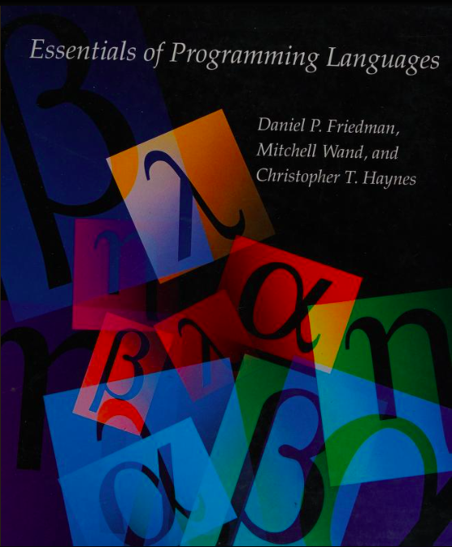

# Essentials of Programming Languages

Authors:

* Daniel P. Friedman
* Mitchell Wand
* Christopher T. Haynes

Foreword by Harold Abelson

按: Harold Abelson是著名的 << SICP >>的作者。

## 最初的想法

<< 编程的本质 >>

按: 大部分的书籍翻译，只是对原书文本的语言上的翻译。至于书籍所要表达的隐含内容，背景知识，往往一带而过，默认读者具有相当的学习能力。然而如我者，一个编程爱好者，来说，这种假设过高估计了读者的专业水平。一个爱好者，想要掌握这门屠龙术的人，是乐于从头学到这些准备知识的。

我需要的是第二本学习用的辅导书，作为对正书学习的辅导材料。其关系相当于<< 左传 >>, << 公羊 >>, << 谷梁 >> 之于 << 春秋 >>, 孔子并没有在书中详细描述七七八八， 他口述给了弟子们，弟子们再将春秋经文的理解写成传，流传下来。所以我想写的并不是翻译，而是对书中蕴含的理论的深刻理解，测试方法，解题方法等，希望能够对所有的读者有所裨益。

原书第一版在网上颇受好评，而电子版有缺失。幸而在 archive.org网站上找到了完整的彩色影印清晰版。在中美贸易战，对抗频频发生的时代，我颇不希望中美脱钩，在文化上，Daniel Friedman, Harold Abelsons是我未曾谋面但高山仰止的大师，虽然白宫的肉食者们行事令人鄙夷，但是心中对美国的科学界，尤其是王垠博士所推荐的印第安纳大学计算机学院的诸位教授，学者，还是充满好感。科学本无国界，本应造福全人类，提高所有人对世界的认知和理解。我衷心希望能够学到他们在计算机科学上的入门知识，提升自己对编程科学的理解。

翻译作品中将夹杂大量的修正，理解，小程序片段等。它不是一本传统意义上的翻译作品，而是一本传，正义，释，解，类型的文体。故称之为编程本质传。是不是有一天我也可以在完成之日，将此书传付梓成书呢？

编译器使用开源的Chiz Scheme. 附带各章例题的所有解答，我希望一名初中生可以理解这本书所要表达的内容。

支持Windows 10, Linux , Mac OS系统。

